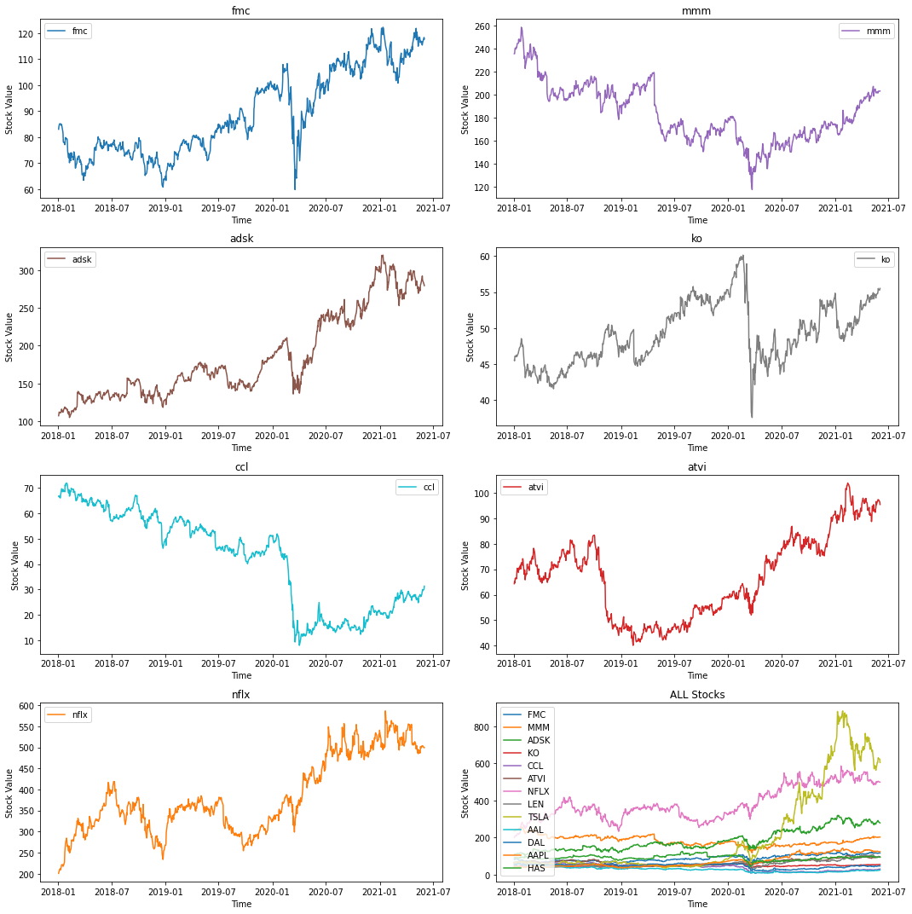
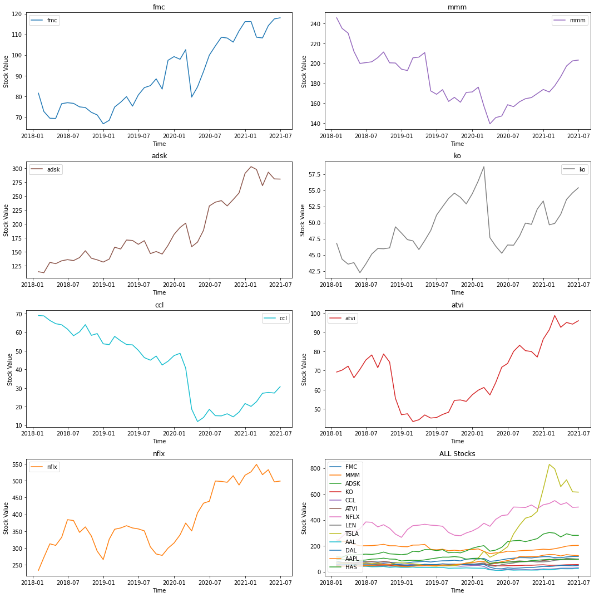
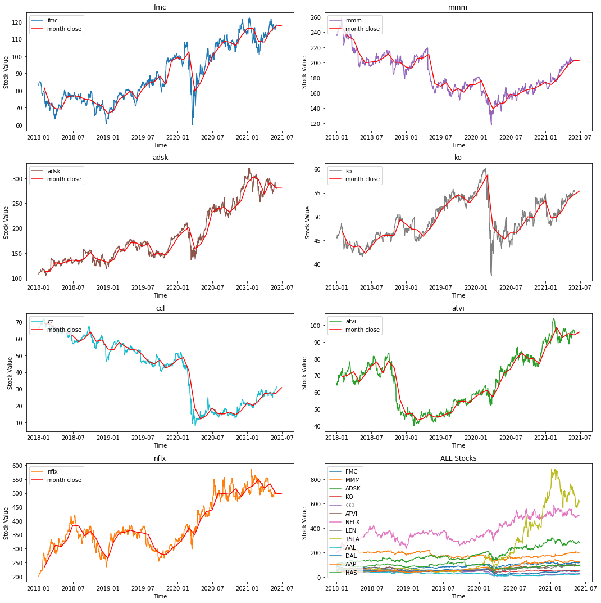
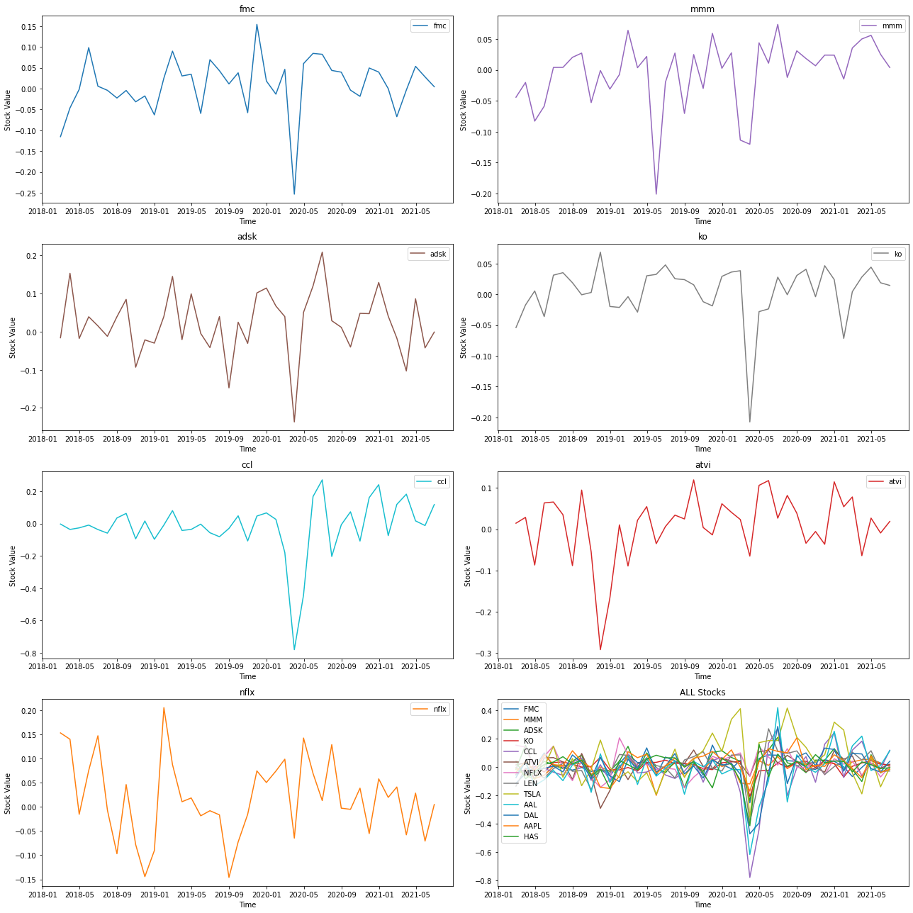
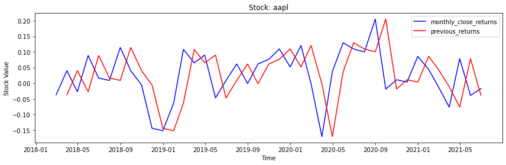
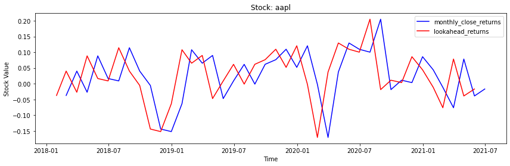
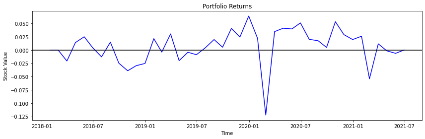

# Trading With Momentum

<em>Aspiration</em>

This notebook was created with the purpose to obtain insights about volatility by finding buying opportunities in short-term uptrends and then sell when the securities start to lose momentum.

## Introduction to Momentum Trading

> <a href="https://www.investopedia.com/trading/introduction-to-momentum-trading/" target="_black">Momentum investing</a> seeks to take advantage of market volatility by taking short-term positions in stocks going up and selling them as soon as they show signs of going down.

## Data Overview

<b>Libraries used</b>


```python
import pandas as pd
import numpy as np
import matplotlib.pyplot as plt
import os

from functools import reduce
from scipy import stats
```

**Market Data** 
<br><br>

Historical data of several companies were selected without any kind of filter from Yahoo finance.

And the period of historial data selected was from <em>Dec 31, 2017</em> to <em>Jun 02, 2021</em>

If you want to run this code it is imperative to download the stocks needed to be analyzed and move them to the folder `stocks_historical_data`. Since such files are large, github doesn't let all .csv files used to be uploaed to the repo.


```python
folder_name = 'stocks_historical_data'
stock_names = [w.replace('.csv', '') for w in os.listdir(folder_name)]
print('STOCKS SELECTED: ')
print(stock_names)
```

    STOCKS SELECTED: 
    ['FMC', 'MMM', 'ADSK', 'KO', 'CCL', 'ATVI', 'NFLX', 'LEN', 'TSLA', 'AAL', 'DAL', 'AAPL', 'HAS']


<b>Stocks's Historical Data Visualization</b>
<br><br>

Let's import each stock data, join all into one data frame and then create a chart for a better visualization


```python
dfs = [] #array for each data frame
folder_name = './stocks_historical_data/'

for name in os.listdir(folder_name):
    dfs.append(pd.read_csv(folder_name + name, parse_dates=['Date'], index_col=False))
```

Let's take a look of how the data set is organized


```python
dfs[0].head()
```


<div>
<style scoped>
    .dataframe tbody tr th:only-of-type {
        vertical-align: middle;
    }

    .dataframe tbody tr th {
        vertical-align: top;
    }

    .dataframe thead th {
        text-align: right;
    }
</style>
<table border="1" class="dataframe">
  <thead>
    <tr style="text-align: right;">
      <th></th>
      <th>Date</th>
      <th>Open</th>
      <th>High</th>
      <th>Low</th>
      <th>Close</th>
      <th>Adj Close</th>
      <th>Volume</th>
    </tr>
  </thead>
  <tbody>
    <tr>
      <th>0</th>
      <td>2018-01-02</td>
      <td>82.723328</td>
      <td>83.217690</td>
      <td>82.471809</td>
      <td>83.026886</td>
      <td>78.704277</td>
      <td>1361693</td>
    </tr>
    <tr>
      <th>1</th>
      <td>2018-01-03</td>
      <td>83.200348</td>
      <td>84.189072</td>
      <td>82.688637</td>
      <td>84.093666</td>
      <td>79.715530</td>
      <td>1090046</td>
    </tr>
    <tr>
      <th>2</th>
      <td>2018-01-04</td>
      <td>84.648743</td>
      <td>85.594101</td>
      <td>84.223763</td>
      <td>84.518646</td>
      <td>80.118385</td>
      <td>1176752</td>
    </tr>
    <tr>
      <th>3</th>
      <td>2018-01-05</td>
      <td>84.969643</td>
      <td>85.411972</td>
      <td>84.388550</td>
      <td>85.065048</td>
      <td>80.636337</td>
      <td>1291937</td>
    </tr>
    <tr>
      <th>4</th>
      <td>2018-01-08</td>
      <td>85.429314</td>
      <td>85.559410</td>
      <td>84.483955</td>
      <td>85.143105</td>
      <td>80.710320</td>
      <td>891846</td>
    </tr>
  </tbody>
</table>
</div>


Since our goal is to only look at <b>closing</b> stock price, lets select only this column and join all dataframes imported into one large data set with respective data sets names.


```python
for i in range(len(dfs)):
    dfs[i] = dfs[i].rename(columns={"Close": stock_names[i].lower()}).set_index('Date')[stock_names[i].lower()]

```

Now we have a single data frame with stock closing price for each company and date


```python
close_prices = reduce(lambda left,right: pd.merge(left,right,on='Date'), dfs)
close_prices = close_prices.reset_index()
close_prices.tail()
```


<div>
<style scoped>
    .dataframe tbody tr th:only-of-type {
        vertical-align: middle;
    }

    .dataframe tbody tr th {
        vertical-align: top;
    }

    .dataframe thead th {
        text-align: right;
    }
</style>
<table border="1" class="dataframe">
  <thead>
    <tr style="text-align: right;">
      <th></th>
      <th>Date</th>
      <th>fmc</th>
      <th>mmm</th>
      <th>adsk</th>
      <th>ko</th>
      <th>ccl</th>
      <th>atvi</th>
      <th>nflx</th>
      <th>len</th>
      <th>tsla</th>
      <th>aal</th>
      <th>dal</th>
      <th>aapl</th>
      <th>has</th>
    </tr>
  </thead>
  <tbody>
    <tr>
      <th>855</th>
      <td>2021-05-26</td>
      <td>115.400002</td>
      <td>201.580002</td>
      <td>292.510010</td>
      <td>55.029999</td>
      <td>29.370001</td>
      <td>97.300003</td>
      <td>502.359985</td>
      <td>98.809998</td>
      <td>619.130005</td>
      <td>23.90</td>
      <td>47.490002</td>
      <td>126.849998</td>
      <td>94.830002</td>
    </tr>
    <tr>
      <th>856</th>
      <td>2021-05-27</td>
      <td>116.239998</td>
      <td>203.240005</td>
      <td>286.670013</td>
      <td>55.490002</td>
      <td>30.000000</td>
      <td>97.250000</td>
      <td>503.859985</td>
      <td>98.949997</td>
      <td>630.849976</td>
      <td>24.43</td>
      <td>48.049999</td>
      <td>125.279999</td>
      <td>95.919998</td>
    </tr>
    <tr>
      <th>857</th>
      <td>2021-05-28</td>
      <td>116.690002</td>
      <td>203.039993</td>
      <td>285.859985</td>
      <td>55.290001</td>
      <td>29.559999</td>
      <td>97.250000</td>
      <td>502.809998</td>
      <td>99.010002</td>
      <td>625.219971</td>
      <td>24.24</td>
      <td>47.680000</td>
      <td>124.610001</td>
      <td>95.970001</td>
    </tr>
    <tr>
      <th>858</th>
      <td>2021-06-01</td>
      <td>118.309998</td>
      <td>203.199997</td>
      <td>281.299988</td>
      <td>55.279999</td>
      <td>30.150000</td>
      <td>96.449997</td>
      <td>499.079987</td>
      <td>98.500000</td>
      <td>623.900024</td>
      <td>24.67</td>
      <td>47.700001</td>
      <td>124.279999</td>
      <td>96.290001</td>
    </tr>
    <tr>
      <th>859</th>
      <td>2021-06-02</td>
      <td>117.699997</td>
      <td>203.289993</td>
      <td>279.670013</td>
      <td>55.500000</td>
      <td>31.309999</td>
      <td>95.389999</td>
      <td>499.239990</td>
      <td>96.349998</td>
      <td>605.119995</td>
      <td>25.82</td>
      <td>47.770000</td>
      <td>125.059998</td>
      <td>95.459999</td>
    </tr>
  </tbody>
</table>
</div>


```python
def plotClosePrices(df=close_prices, stock_names=stock_names, nrows=4, ncols=2, figsize=(15,15)):
    fig, axs = plt.subplots(nrows=nrows, ncols=ncols, figsize=figsize)
    fig.patch.set_facecolor('xkcd:white')

    list_colors = ['tab:blue', 'tab:purple', 'tab:brown', 'tab:gray', 'tab:cyan', 'tab:red', 'tab:orange']

    k = 0
    for i in range(4):
        for j in range(2):
            if k == 7:
                df = df.set_index('Date')
                name = 'ALL Stocks'
                axs[i, j].set_title(name)
                axs[i, j].plot(df.index, df)
                axs[i, j].set_xlabel("Time")
                axs[i, j].set_ylabel("Stock Value")
                axs[i, j].legend(stock_names, loc='upper left')
            else:
                name = stock_names[k].lower()
                axs[i, j].set_title(name)
                axs[i, j].plot(df['Date'], df[name], color=list_colors[k])
                axs[i, j].set_xlabel("Time")
                axs[i, j].set_ylabel("Stock Value")
                axs[i, j].legend([name])
            k+=1

    fig.tight_layout()
plotClosePrices()
```


    

    


## Resample Adjusted Prices

The trading signal we've developed does not need to be based on daily prices, for instance, it can use month-end prices to perform trading once a month. To do this, we had to first resample the daily adjusted closing prices into monthly buckets, and then select the last observation of each month.


```python
def resample_prices(close_prices, freq='M'):
    """
    Parameters
    ----------
    close_prices : DataFrame
        Close prices for each ticker and date
    freq : str
        What frequency to sample at
        For valid freq choices, see http://pandas.pydata.org/pandas-docs/stable/timeseries.html#offset-aliases
    
    Returns
    -------
    prices_resampled : DataFrame
        Resampled prices for each ticker and date
    """
    
    
    return close_prices.resample(freq, on='Date').mean()

# Lets reorganize the data in order to get montly close prices
monthly_close_returns = resample_prices(close_prices).reset_index()
monthly_close_returns.head()
```


<div>
<style scoped>
    .dataframe tbody tr th:only-of-type {
        vertical-align: middle;
    }

    .dataframe tbody tr th {
        vertical-align: top;
    }

    .dataframe thead th {
        text-align: right;
    }
</style>
<table border="1" class="dataframe">
  <thead>
    <tr style="text-align: right;">
      <th></th>
      <th>Date</th>
      <th>fmc</th>
      <th>mmm</th>
      <th>adsk</th>
      <th>ko</th>
      <th>ccl</th>
      <th>atvi</th>
      <th>nflx</th>
      <th>len</th>
      <th>tsla</th>
      <th>aal</th>
      <th>dal</th>
      <th>aapl</th>
      <th>has</th>
    </tr>
  </thead>
  <tbody>
    <tr>
      <th>0</th>
      <td>2018-01-31</td>
      <td>81.500433</td>
      <td>245.562858</td>
      <td>113.863334</td>
      <td>46.797143</td>
      <td>68.988572</td>
      <td>69.228572</td>
      <td>232.908096</td>
      <td>68.133333</td>
      <td>67.716666</td>
      <td>54.902857</td>
      <td>57.202857</td>
      <td>43.501309</td>
      <td>92.858571</td>
    </tr>
    <tr>
      <th>1</th>
      <td>2018-02-28</td>
      <td>72.630667</td>
      <td>234.961053</td>
      <td>112.075263</td>
      <td>44.332105</td>
      <td>68.783684</td>
      <td>70.237895</td>
      <td>271.443683</td>
      <td>59.498421</td>
      <td>67.155474</td>
      <td>51.838947</td>
      <td>53.066841</td>
      <td>41.909737</td>
      <td>96.821579</td>
    </tr>
    <tr>
      <th>2</th>
      <td>2018-03-31</td>
      <td>69.351589</td>
      <td>230.240000</td>
      <td>130.651429</td>
      <td>43.567142</td>
      <td>66.330001</td>
      <td>72.278096</td>
      <td>312.228097</td>
      <td>59.009524</td>
      <td>63.196666</td>
      <td>53.804286</td>
      <td>55.022381</td>
      <td>43.624048</td>
      <td>89.072381</td>
    </tr>
    <tr>
      <th>3</th>
      <td>2018-04-30</td>
      <td>69.241731</td>
      <td>211.945238</td>
      <td>128.351428</td>
      <td>43.801429</td>
      <td>64.593809</td>
      <td>66.264285</td>
      <td>307.466192</td>
      <td>57.213333</td>
      <td>57.954572</td>
      <td>47.177619</td>
      <td>53.596667</td>
      <td>42.458572</td>
      <td>85.831428</td>
    </tr>
    <tr>
      <th>4</th>
      <td>2018-05-31</td>
      <td>76.418041</td>
      <td>199.880000</td>
      <td>133.487729</td>
      <td>42.242273</td>
      <td>63.985000</td>
      <td>70.619545</td>
      <td>331.536819</td>
      <td>52.870455</td>
      <td>57.970455</td>
      <td>43.078637</td>
      <td>53.083182</td>
      <td>46.384204</td>
      <td>87.332727</td>
    </tr>
  </tbody>
</table>
</div>


It is possible to see  below the closing end price for each month for each one of the selected stocks.


```python
plotClosePrices(df=monthly_close_returns)
```


    

    


Now let's compare the <b>month closing price charts</b> to <b>day closing price charts</b>


```python
def plotClosePricesMonthDay(df1=close_prices, df2=monthly_close_returns, stock_names=stock_names, nrows=4, ncols=2, figsize=(15,15)):
    
    fig, axs = plt.subplots(nrows=nrows, ncols=ncols, figsize=figsize)
    fig.patch.set_facecolor('xkcd:white')

    list_colors = ['tab:blue', 'tab:purple', 'tab:brown', 'tab:gray', 'tab:cyan', 'tab:green', 'tab:orange']

    k = 0
    for i in range(4):
        for j in range(2):
            if k == 7:
                df1 = df1.set_index('Date')
                name = 'ALL Stocks'
                axs[i, j].set_title(name)
                axs[i, j].plot(df1.index, df1)
                axs[i, j].set_xlabel("Time")
                axs[i, j].set_ylabel("Stock Value")
                axs[i, j].legend(stock_names, loc='upper left')
            else:
                name = stock_names[k].lower()
                axs[i, j].set_title(name)
                axs[i, j].plot(df1['Date'], df1[name], color=list_colors[k], label=name)
                axs[i, j].plot(df2['Date'], df2[name], color="red", label="month close")
                axs[i, j].set_xlabel("Time")
                axs[i, j].set_ylabel("Stock Value")
                axs[i, j].legend(loc='upper left')
            k+=1

    fig.tight_layout()
    plt.show()
plotClosePricesMonthDay()
```


    

    


## Log Returns

Log returns can work as a momentum indicator. 

Log returns ($R_t$) from prices ($P_t$):

$$R_t = log_e(P_t) - log_e(P_{t-1})$$


```python
def compute_log_returns(prices):
    """
    Parameters
    ----------
    prices : DataFrame
        Prices for each ticker and date
    
    Returns
    -------
    log_returns : DataFrame
        Log returns for each ticker and date
    """
    prices = prices.set_index('Date')
    prices = np.log(prices) - np.log(prices.shift(1))
    
    return prices

monthly_close_log_returns = compute_log_returns(monthly_close_returns)
monthly_close_log_returns.head()
```


<div>
<style scoped>
    .dataframe tbody tr th:only-of-type {
        vertical-align: middle;
    }

    .dataframe tbody tr th {
        vertical-align: top;
    }

    .dataframe thead th {
        text-align: right;
    }
</style>
<table border="1" class="dataframe">
  <thead>
    <tr style="text-align: right;">
      <th></th>
      <th>fmc</th>
      <th>mmm</th>
      <th>adsk</th>
      <th>ko</th>
      <th>ccl</th>
      <th>atvi</th>
      <th>nflx</th>
      <th>len</th>
      <th>tsla</th>
      <th>aal</th>
      <th>dal</th>
      <th>aapl</th>
      <th>has</th>
    </tr>
    <tr>
      <th>Date</th>
      <th></th>
      <th></th>
      <th></th>
      <th></th>
      <th></th>
      <th></th>
      <th></th>
      <th></th>
      <th></th>
      <th></th>
      <th></th>
      <th></th>
      <th></th>
    </tr>
  </thead>
  <tbody>
    <tr>
      <th>2018-01-31</th>
      <td>NaN</td>
      <td>NaN</td>
      <td>NaN</td>
      <td>NaN</td>
      <td>NaN</td>
      <td>NaN</td>
      <td>NaN</td>
      <td>NaN</td>
      <td>NaN</td>
      <td>NaN</td>
      <td>NaN</td>
      <td>NaN</td>
      <td>NaN</td>
    </tr>
    <tr>
      <th>2018-02-28</th>
      <td>-0.115221</td>
      <td>-0.044133</td>
      <td>-0.015828</td>
      <td>-0.054113</td>
      <td>-0.002974</td>
      <td>0.014474</td>
      <td>0.153111</td>
      <td>-0.135517</td>
      <td>-0.008322</td>
      <td>-0.057424</td>
      <td>-0.075052</td>
      <td>-0.037273</td>
      <td>0.041792</td>
    </tr>
    <tr>
      <th>2018-03-31</th>
      <td>-0.046198</td>
      <td>-0.020298</td>
      <td>0.153362</td>
      <td>-0.017406</td>
      <td>-0.036324</td>
      <td>0.028633</td>
      <td>0.139979</td>
      <td>-0.008251</td>
      <td>-0.060759</td>
      <td>0.037211</td>
      <td>0.036188</td>
      <td>0.040090</td>
      <td>-0.083421</td>
    </tr>
    <tr>
      <th>2018-04-30</th>
      <td>-0.001585</td>
      <td>-0.082794</td>
      <td>-0.017761</td>
      <td>0.005363</td>
      <td>-0.026524</td>
      <td>-0.086870</td>
      <td>-0.015369</td>
      <td>-0.030912</td>
      <td>-0.086592</td>
      <td>-0.131434</td>
      <td>-0.026253</td>
      <td>-0.027080</td>
      <td>-0.037064</td>
    </tr>
    <tr>
      <th>2018-05-31</th>
      <td>0.098615</td>
      <td>-0.058611</td>
      <td>0.039238</td>
      <td>-0.036245</td>
      <td>-0.009470</td>
      <td>0.063656</td>
      <td>0.075374</td>
      <td>-0.078942</td>
      <td>0.000274</td>
      <td>-0.090892</td>
      <td>-0.009627</td>
      <td>0.088430</td>
      <td>0.017340</td>
    </tr>
  </tbody>
</table>
</div>


Let's visualize such log returns in charts


```python
plotClosePrices(df=monthly_close_log_returns.reset_index(), figsize=(18,18))
```


    

    


## Shift Returns


```python
def shift_returns(returns, shift_n):
    """
    Parameters
    ----------
    returns : DataFrame
        Returns for each ticker and date
    shift_n : int
        Number of periods to move, can be positive or negative
    
    Returns
    -------
    shifted_returns : DataFrame
        Shifted returns for each ticker and date
    """
    
    return returns.shift(shift_n)

shift_returns(monthly_close_log_returns, 1).head()
```


<div>
<style scoped>
    .dataframe tbody tr th:only-of-type {
        vertical-align: middle;
    }

    .dataframe tbody tr th {
        vertical-align: top;
    }

    .dataframe thead th {
        text-align: right;
    }
</style>
<table border="1" class="dataframe">
  <thead>
    <tr style="text-align: right;">
      <th></th>
      <th>fmc</th>
      <th>mmm</th>
      <th>adsk</th>
      <th>ko</th>
      <th>ccl</th>
      <th>atvi</th>
      <th>nflx</th>
      <th>len</th>
      <th>tsla</th>
      <th>aal</th>
      <th>dal</th>
      <th>aapl</th>
      <th>has</th>
    </tr>
    <tr>
      <th>Date</th>
      <th></th>
      <th></th>
      <th></th>
      <th></th>
      <th></th>
      <th></th>
      <th></th>
      <th></th>
      <th></th>
      <th></th>
      <th></th>
      <th></th>
      <th></th>
    </tr>
  </thead>
  <tbody>
    <tr>
      <th>2018-01-31</th>
      <td>NaN</td>
      <td>NaN</td>
      <td>NaN</td>
      <td>NaN</td>
      <td>NaN</td>
      <td>NaN</td>
      <td>NaN</td>
      <td>NaN</td>
      <td>NaN</td>
      <td>NaN</td>
      <td>NaN</td>
      <td>NaN</td>
      <td>NaN</td>
    </tr>
    <tr>
      <th>2018-02-28</th>
      <td>NaN</td>
      <td>NaN</td>
      <td>NaN</td>
      <td>NaN</td>
      <td>NaN</td>
      <td>NaN</td>
      <td>NaN</td>
      <td>NaN</td>
      <td>NaN</td>
      <td>NaN</td>
      <td>NaN</td>
      <td>NaN</td>
      <td>NaN</td>
    </tr>
    <tr>
      <th>2018-03-31</th>
      <td>-0.115221</td>
      <td>-0.044133</td>
      <td>-0.015828</td>
      <td>-0.054113</td>
      <td>-0.002974</td>
      <td>0.014474</td>
      <td>0.153111</td>
      <td>-0.135517</td>
      <td>-0.008322</td>
      <td>-0.057424</td>
      <td>-0.075052</td>
      <td>-0.037273</td>
      <td>0.041792</td>
    </tr>
    <tr>
      <th>2018-04-30</th>
      <td>-0.046198</td>
      <td>-0.020298</td>
      <td>0.153362</td>
      <td>-0.017406</td>
      <td>-0.036324</td>
      <td>0.028633</td>
      <td>0.139979</td>
      <td>-0.008251</td>
      <td>-0.060759</td>
      <td>0.037211</td>
      <td>0.036188</td>
      <td>0.040090</td>
      <td>-0.083421</td>
    </tr>
    <tr>
      <th>2018-05-31</th>
      <td>-0.001585</td>
      <td>-0.082794</td>
      <td>-0.017761</td>
      <td>0.005363</td>
      <td>-0.026524</td>
      <td>-0.086870</td>
      <td>-0.015369</td>
      <td>-0.030912</td>
      <td>-0.086592</td>
      <td>-0.131434</td>
      <td>-0.026253</td>
      <td>-0.027080</td>
      <td>-0.037064</td>
    </tr>
  </tbody>
</table>
</div>


### Shift return applications

With de above function it is possible to compare previous/lookahead_returns values. The section below show us such application in charts.

#### View Data

Let's get the previous month's and next month's returns.


```python
prev_returns = shift_returns(monthly_close_log_returns, 1)
lookahead_returns = shift_returns(monthly_close_log_returns, -1)
```


```python
def plotPrevLookAhead(stock_name, df1, df2, label1, label2,
                      nrows=1, ncols=1, figsize=(12,4)):
    
    fig, axs = plt.subplots(figsize=figsize)
    fig.patch.set_facecolor('xkcd:white')
    
    df1 = df1[stock_name]
    df2 = df2.set_index('Date')[stock_name]

    axs.set_title('Stock: ' + stock_name)
    axs.plot(df1.index, df1, color="blue", label=label1)
    axs.plot(df2.index, df2, color="red", label=label2)
    axs.set_xlabel("Time")
    axs.set_ylabel("Stock Value")
    axs.legend()

    fig.tight_layout()
    plt.show()
```

#### Previous Returns

Comparisson between monthly close returns and previous returns


```python
plotPrevLookAhead('aapl', monthly_close_log_returns, prev_returns.reset_index(), 'monthly_close_returns', 'previous_returns')
```


    

    


#### Lookahead returns

Comparisson between monthly close returns and forehead returns


```python
plotPrevLookAhead('aapl', monthly_close_log_returns, lookahead_returns.reset_index(), 'monthly_close_returns', 'lookahead_returns')
```


    

    


## Generate Trading Signal

A trading signal is a sequence of trading actions, or results that can be used to take trading actions. A common form is to produce a "long" and "short" portfolio of stocks on each date (e.g. end of each month, or whatever frequency you desire to trade at). This signal can be interpreted as rebalancing your portfolio on each of those dates, entering long ("buy") and short ("sell") positions as indicated.

The following strategy can be used 

>For each month-end observation period, rank the stocks by previous returns, from the highest to the lowest. Select the top performing stocks for the long portfolio, and the bottom performing stocks for the short portfolio.


```python
def get_top_n(prev_returns, top_n):
    """
    Parameters
    ----------
    prev_returns : DataFrame
        Previous shifted returns for each ticker and date
    top_n : int
        The number of top performing stocks to get
    
    Returns
    -------
    top_stocks : DataFrame
        Top stocks for each ticker and date marked with a 1
    """
    frames = []
    row = 0
    for i, r in prev_returns.iterrows():
        arr = r.nlargest(top_n).values
        boolean_series = r.isin(arr)
        
        frames.append(boolean_series.to_frame().T)
    df = pd.concat(frames)
    
    return df.astype(int)
```

With that approach we can select the *10 Most Longed Stocks* and *10 Most Shorted Stocks*  
<br/>

**OBS:** If we pass in `-1*prev_returns` instead of just `prev_returns`. Multiplying by negative one will flip all the positive returns to negative and negative returns to positive. Thus, it will return the worst performing stocks.


```python
top_stocks = 4
bottom_stocks = 0
df_long = get_top_n(prev_returns, top_stocks)
df_short = get_top_n(-1*prev_returns, bottom_stocks)

print('{} Most Longed Stocks:'.format(top_stocks))
print(*df_long.sum().nlargest(top_stocks).index, sep = ", ") 
print('\n{} Most Shorted Stocks:'.format(bottom_stocks))
print(*df_short.sum().nlargest(bottom_stocks).index, sep = ", ") 
```

    4 Most Longed Stocks:
    tsla, aapl, adsk, len
    
    0 Most Shorted Stocks:
    


## Projected Returns

It's now time to check if our trading signal has the potential to become profitable.


```python
def portfolio_returns(df_long, df_short, lookahead_returns, n_stocks):
    """
    Parameters
    ----------
    df_long : DataFrame
        Top stocks for each ticker and date marked with a 1
    df_short : DataFrame
        Bottom stocks for each ticker and date marked with a 1
    lookahead_returns : DataFrame
        Lookahead returns for each ticker and date
    n_stocks: int
        The number of stocks chosen for each month
    
    Returns
    -------
    portfolio_returns : DataFrame
        Expected portfolio returns for each ticker and date
    """
    
    return ((df_long - df_short) * lookahead_returns)/n_stocks

n_stocks = 2*top_stocks + 2*bottom_stocks
expected_portfolio_returns = portfolio_returns(df_long, df_short, lookahead_returns, n_stocks)
```

The expected return using `n_stocks = 2*top_bottom_n` will be:


```python
expected_portfolio_returns.head()
```


<div>
<style scoped>
    .dataframe tbody tr th:only-of-type {
        vertical-align: middle;
    }

    .dataframe tbody tr th {
        vertical-align: top;
    }

    .dataframe thead th {
        text-align: right;
    }
</style>
<table border="1" class="dataframe">
  <thead>
    <tr style="text-align: right;">
      <th></th>
      <th>fmc</th>
      <th>mmm</th>
      <th>adsk</th>
      <th>ko</th>
      <th>ccl</th>
      <th>atvi</th>
      <th>nflx</th>
      <th>len</th>
      <th>tsla</th>
      <th>aal</th>
      <th>dal</th>
      <th>aapl</th>
      <th>has</th>
    </tr>
  </thead>
  <tbody>
    <tr>
      <th>2018-01-31</th>
      <td>-0.000000</td>
      <td>-0.0</td>
      <td>-0.000000</td>
      <td>-0.000000</td>
      <td>-0.000000</td>
      <td>0.000000</td>
      <td>0.000000</td>
      <td>-0.0</td>
      <td>-0.0</td>
      <td>-0.000000</td>
      <td>-0.0</td>
      <td>-0.000000</td>
      <td>0.000000</td>
    </tr>
    <tr>
      <th>2018-02-28</th>
      <td>-0.000000</td>
      <td>-0.0</td>
      <td>0.000000</td>
      <td>-0.000000</td>
      <td>-0.000000</td>
      <td>0.000000</td>
      <td>0.000000</td>
      <td>-0.0</td>
      <td>-0.0</td>
      <td>0.000000</td>
      <td>0.0</td>
      <td>0.000000</td>
      <td>-0.000000</td>
    </tr>
    <tr>
      <th>2018-03-31</th>
      <td>-0.000000</td>
      <td>-0.0</td>
      <td>-0.000000</td>
      <td>0.000000</td>
      <td>-0.003315</td>
      <td>-0.010859</td>
      <td>-0.001921</td>
      <td>-0.0</td>
      <td>-0.0</td>
      <td>-0.000000</td>
      <td>-0.0</td>
      <td>-0.000000</td>
      <td>-0.004633</td>
    </tr>
    <tr>
      <th>2018-04-30</th>
      <td>0.000000</td>
      <td>-0.0</td>
      <td>0.004905</td>
      <td>-0.000000</td>
      <td>-0.000000</td>
      <td>0.000000</td>
      <td>0.009422</td>
      <td>-0.0</td>
      <td>0.0</td>
      <td>-0.011362</td>
      <td>-0.0</td>
      <td>0.011054</td>
      <td>0.000000</td>
    </tr>
    <tr>
      <th>2018-05-31</th>
      <td>0.000736</td>
      <td>0.0</td>
      <td>0.001907</td>
      <td>0.003879</td>
      <td>-0.000000</td>
      <td>0.000000</td>
      <td>0.018406</td>
      <td>-0.0</td>
      <td>0.0</td>
      <td>-0.000000</td>
      <td>0.0</td>
      <td>0.000000</td>
      <td>0.000000</td>
    </tr>
  </tbody>
</table>
</div>


```python
expected_portfolio_returns_by_date = expected_portfolio_returns.T.sum().dropna()
expected_portfolio_returns_by_date
```


    2018-01-31    0.000000
    2018-02-28    0.000000
    2018-03-31   -0.020728
    2018-04-30    0.014019
    2018-05-31    0.024928
    2018-06-30    0.004136
    2018-07-31   -0.012927
    2018-08-31    0.014744
    2018-09-30   -0.024907
    2018-10-31   -0.039059
    2018-11-30   -0.029481
    2018-12-31   -0.025296
    2019-01-31    0.021356
    2019-02-28   -0.003927
    2019-03-31    0.030278
    2019-04-30   -0.020044
    2019-05-31   -0.004263
    2019-06-30   -0.008833
    2019-07-31    0.004102
    2019-08-31    0.019682
    2019-09-30    0.005221
    2019-10-31    0.040616
    2019-11-30    0.024362
    2019-12-31    0.063857
    2020-01-31    0.022011
    2020-02-29   -0.122490
    2020-03-31    0.034594
    2020-04-30    0.040921
    2020-05-31    0.039672
    2020-06-30    0.050996
    2020-07-31    0.020031
    2020-08-31    0.017492
    2020-09-30    0.004877
    2020-10-31    0.053285
    2020-11-30    0.028946
    2020-12-31    0.019671
    2021-01-31    0.025935
    2021-02-28   -0.054194
    2021-03-31    0.011637
    2021-04-30   -0.001582
    2021-05-31   -0.006258
    2021-06-30    0.000000
    dtype: float64


```python
def plotPortfolioReturn(df=portfolio_rtn, nrows=1, ncols=1, figsize=(12,4)):
    
    fig, axs = plt.subplots(figsize=figsize)
    fig.patch.set_facecolor('xkcd:white')
    df = expected_portfolio_returns.T.sum()
    
    axs.set_title('Portfolio Returns')
    axs.plot(df.index, df, color="blue")
    axs.axhline(y=0, color='black', linestyle='-')
    axs.set_xlabel("Time")
    axs.set_ylabel("Stock Value")

    fig.tight_layout()
    plt.show()
    
plotPortfolioReturn()
```


    

    


## Statistical Tests

### Annualized Rate of Return


```python
portfolio_ret_mean = expected_portfolio_returns_by_date.mean()
portfolio_ret_ste = expected_portfolio_returns_by_date.sem()
portfolio_ret_annual_rate = (np.exp(portfolio_ret_mean * 12) - 1) * 100

print("""
Mean:                       {:.6f}
Standard Error:             {:.6f}
Annualized Rate of Return:  {:.2f}%
""".format(portfolio_ret_mean, portfolio_ret_ste, portfolio_ret_annual_rate))
```

    
    Mean:                       0.006271
    Standard Error:             0.005021
    Annualized Rate of Return:  7.82%
    


The annualized rate of return allows you to compare the rate of return from this strategy to other quoted rates of return, which are usually quoted on an annual basis. 

### T-Test
Our null hypothesis ($H_0$) is that the actual mean return from the signal is zero. We'll perform a one-sample, one-sided t-test on the observed mean return, to see if we can reject $H_0$.

We'll need to first compute the t-statistic, and then find its corresponding p-value. _The p-value will indicate the probability of observing a t-statistic equally or more extreme than the one we observed if the null hypothesis were true_. A small p-value means that the chance of observing the t-statistic we observed under the null hypothesis is small, and thus casts doubt on the null hypothesis. It's good practice to set a desired level of significance or alpha ($\alpha$) _before_ computing the p-value, and then reject the null hypothesis if $p < \alpha$.

Lets use $\alpha = 0.05$, since it's a common value to use.


```python
def analyze_alpha(expected_portfolio_returns_by_date):
    """
    Parameters
    ----------
    expected_portfolio_returns_by_date : Pandas Series
        Expected portfolio returns for each date
    
    Returns
    -------
    t_value
        T-statistic from t-test
    p_value
        Corresponding p-value
    """
    
    ans = stats.ttest_1samp(expected_portfolio_returns_by_date, 0.0)
    return ans[0], ans[1]/2

ret = analyze_alpha(expected_portfolio_returns_by_date)
print('Alpha analysis')
print('t-value: {}\np-value: {}'.format(ret[0], ret[1]))
```

    Alpha analysis
    t-value: 1.2490192852079738
    p-value: 0.10937118906658572


If the p-value is lower than a pre-defined number (0.05), the null hypothesis is rejected and we claim that the result is statistically significant and thet the alternative hypothesis is true. Since the p-value from our analysis is `greater` than 0.05 we say that our alternative hypothesis is false.

Now we can create an *algorithm* in order to find how many `long stocks` and `short stocks` we should buy looking forward obtaining `p_value < 0.05`


```python
def findLowPValue(prev_returns=prev_returns, lookahead_returns=lookahead_returns):
    p_value = 100
    for i in range(len(stock_names)):
        top_stocks = i
        for j in range(len(stock_names)):
            bottom_stocks = j
            df_long = get_top_n(prev_returns, top_stocks)
            df_short = get_top_n(-1*prev_returns, bottom_stocks)

            n_stocks = 2*top_stocks + 2*bottom_stocks
            expected_portfolio_returns = portfolio_returns(df_long, df_short, lookahead_returns, n_stocks)

            expected_portfolio_returns_by_date = expected_portfolio_returns.T.sum().dropna()

            portfolio_ret_mean = expected_portfolio_returns_by_date.mean()
            portfolio_ret_ste = expected_portfolio_returns_by_date.sem()
            portfolio_ret_annual_rate = (np.exp(portfolio_ret_mean * 12) - 1) * 100

            ret = analyze_alpha(expected_portfolio_returns_by_date)
            if ret[1] < p_value:
                p_value = ret[1]
            
            if p_value < 0.05 and bottom_stocks > 1:
                break
                
    print('Alpha analysis')
    print('t-value: {}\np-value: {}'.format(ret[0], p_value))
    print('\n---------------\n')
    print('How many stocks to buy:')
    print('top_stocks: ', top_stocks)
    print('bottom_stocks: ', bottom_stocks)
    
findLowPValue()
```

    Alpha analysis
    t-value: 1.1856702285534035
    p-value: 0.031756091446011984
    
    ---------------
    
    How many stocks to buy:
    top_stocks:  12
    bottom_stocks:  2


```python

```
